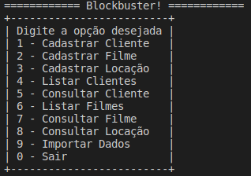

# CSharp: Simple MVC Blockbuster

A mini blockbuster to exemplify the MVC structure on C# (yes likely equal the other repository :sweat:, but better :grimacing:)

## Run locally

### Prerequisites
- .NET Core

### Steps
1. `dotnet run`

It's a simple console execution :laughing:

  

